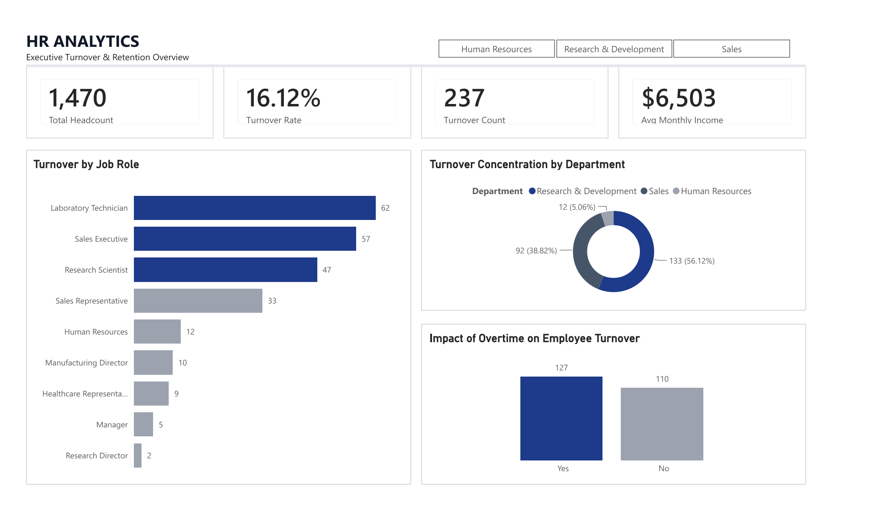

# HR Analytics & Executive Retention Dashboard

An enterprise-grade Power BI dashboard built to analyze workforce metrics, track turnover trends, and evaluate the impact of overtime and departmental distribution.

## 📊 Executive HR Analytics Dashboard

* **Download Full Report:** [View HR Analytics Dashboard PDF](hr-analytics-dashboard-overview.pdf)

## 🔍 Key Performance Indicators (KPIs)
* **Total Headcount:** 1,470
* **Turnover Rate:** 16.12%
* **Turnover Count:** 237
* **Average Monthly Income:** $6,503

## 🧠 Key Insights & Learnings
* **Turnover Concentration:** Identified specific departments and job roles experiencing higher attrition rates, highlighting areas where retention strategies should be targeted.
* **Overtime Impact:** Evaluated how extended overtime hours correlate with employee turnover trends across the organization.
* **Dashboard Design & Architecture:** Mastered grid alignment, professional color theory (navy/slate/light-gray palettes), and functional tile slicer integration to maximize executive readability.

## 🛠️ Technical Implementation & Features
* **Platform:** Power BI Desktop
* **Design Principles:** Two-tier professional header, structured grid alignment, and interactive department filtering.
* **Core Visuals:** Stacked bar charts, donut distribution charts, and comparative metric cards.
